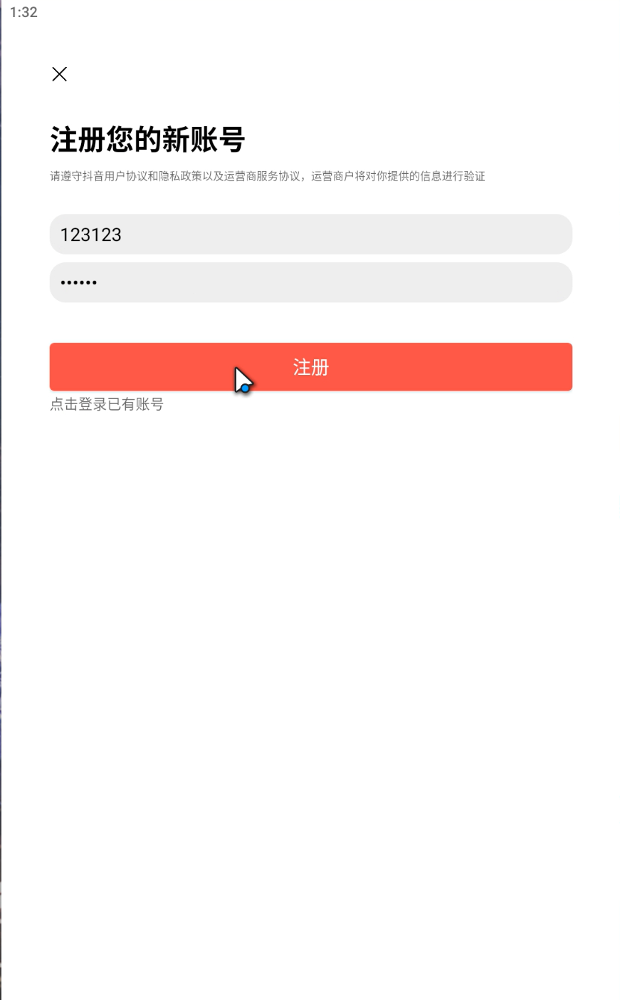
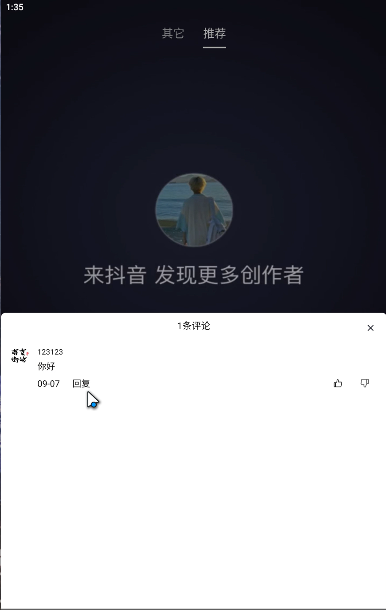
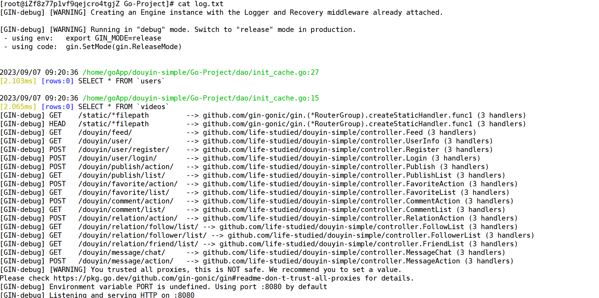

# douyin-simple

## 项目简介

`douyin-simple` 是一个模仿抖音的后端学习项目，使用 Go 语言和 HTTP 框架等开发。它旨在帮助开发人员深入学习和理解后端开发的实践，并提供模仿抖音的功能和特点。 

项目特点： 

1. **视频上传与存储**：douyin-simple 实现了视频的上传和存储功能，用户可以通过接口将视频文件上传至服务器，并安全地存储到指定位置。这为开发者提供了探索和实践大型文件处理的机会。 
2. **用户管理与鉴权**：项目中包含用户管理和身份验证的功能。用户可以注册、登录和注销账户，并进行权限管理。通过合理的鉴权机制，保证了用户信息和视频内容的安全性。 
3. **视频列表与推荐算法**：douyin-simple 提供了展示视频列表和推荐算法的功能。用户可以浏览最新发布的视频、热门视频以及个性化推荐的视频内容。这一特点使得项目更加贴近实际产品，并提供了学习和实现推荐算法的机会。 
4. **点赞与评论系统**：用户可以对喜欢的视频进行点赞，并留下评论。点赞和评论系统的实现使得用户之间可以进行互动和交流。这一功能是社交类应用中常见且重要的部分，为开发者提供了实现用户间互动的接口设计和逻辑处理的机会。 
5. **统计与数据分析**：douyin-simple 支持对视频观看量、点赞数等数据进行统计和分析。这一功能使得开发者能够探索使用数据来优化用户体验和提高应用性能的方法。 

## 启动项目

```
cd ./Go-Project
go mod tidy
go build
./douyin-simple
```

## 项目结构说明

> `douyin-simple`
>
> >`.gitignore` -- 忽略提交配置
> >
> >`README.md` -- 项目自述文件
> >
> >`documents` -- 环境搭建、编码规范、项目需求等等文档资源
> >
> >`Go-Project` -- Go后端项目主体文件

## 软件架构

### Go技术栈

#### 后端核心技术栈

| 技术       | 说明              | 版本   | 备注                                  |
| ---------- | ----------------- | ------ | ------------------------------------- |
| `gorm`     | `MySql`连接驱动库 | 1.25.4 | https://gorm.io/zh_CN/docs/index.html |
| `go-redis` | `redis`连接客户端 |        | https://github.com/redis/go-redis     |
| gin        | http框架          | 1.9.1  | https://gin-gonic.com/zh-cn/docs/     |

#### 后端拓展技术栈

| 技术  | 说明           | 版本   | 备注                           |
| ----- | -------------- | ------ | ------------------------------ |
| viper | 配置解决方案库 | 1.16.0 | https://github.com/spf13/viper |

## 环境要求

### 开发工具

| 工具      | 说明                  | 版本   | 备注                                                         |
| --------- | --------------------- | ------ | ------------------------------------------------------------ |
| `GoLand`  | `Go`开发IDE           |        |                                                              |
| `Git`     | 项目版本管控工具      | latest | https://git-scm.com/                                         |
| `RDM`     | `Redis`可视化管理工具 | latest | https://github.com/uglide/RedisDesktopManager https://gitee.com/qishibo/AnotherRedisDesktopManager |
| `Navicat` | 数据库连接工具        | latest | https://www.navicat.com.cn/                                  |
| `Apipost` | `API`接口调试工具     | latest | https://www.apipost.cn/                                      |

### 开发环境

| 依赖环境  | 版本 | 备注                      |
| --------- | ---- | ------------------------- |
| `Windows` | 10+  | 操作系统                  |
| `golang`  | 1.20 | https://golang.google.cn/ |

### 服务器环境

| 依赖环境 | 版本   | 备注                      |
| -------- | ------ | ------------------------- |
| `CentOS` | 8      |                           |
| `Docker` | latest | https://www.docker.com/   |
| `MySQL`  | 8.0.20 | https://www.mysql.com/cn/ |
| `Redis`  | 6.2.7  | https://redis.io/         |

## 项目搭建

​	详见[项目搭建文档](./documents/01-项目需求/业务参考系统/README.md)。

## 运行效果截图

### 前端App






### 后端服务器



## 开发组成员

| 成员      | 联系方式            |
| --------- | ------------------- |
| 云隐      | yunyin_jayyi@qq.com |
| Echo      | 2116018091@qq.com   |
| 小封      | 3577536707@qq.com   |
| 醉梦      | 1184387860@qq.com   |
| 老八      | 2986566788@qq.com   |
| ABYSMILER | 2932418551@qq.com   |
| 布伦达    | Ely17520@163.com    |

